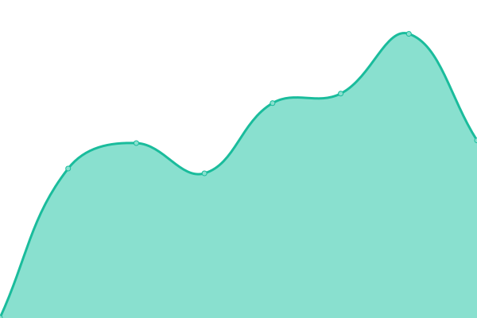

# [📈 Live Status](https://status.ta3.dev): <!--live status--> **🟩 All systems operational**

This repository contains the open-source uptime monitor and status page for [Taha Al-Jody](https://ta3.dev), powered by [Upptime](https://github.com/upptime/upptime).

With [Upptime](https://upptime.js.org), you can get your own unlimited and free uptime monitor and status page, powered entirely by a GitHub repository. We use [Issues](https://github.com/TA3/status/issues) as incident reports, [Actions](https://github.com/TA3/status/actions) as uptime monitors, and [Pages](https://status.ta3.dev) for the status page.

<!--start: status pages-->
<!-- This summary is generated by Upptime (https://github.com/upptime/upptime) -->
<!-- Do not edit this manually, your changes will be overwritten -->
<!-- prettier-ignore -->
| URL | Status | History | Response Time | Uptime |
| --- | ------ | ------- | ------------- | ------ |
|  [ta3.dev](https://ta3.dev) | 🟩 Up | [ta3-dev.yml](https://github.com/TA3/status/commits/HEAD/history/ta3-dev.yml) | 

 366ms
     
 | 

<a href="https://status.ta3.dev/history/ta3-dev">100.00%</a>
    

|  [StayHome](https://stayhome.ta3.dev) | 🟩 Up | [stay-home.yml](https://github.com/TA3/status/commits/HEAD/history/stay-home.yml) | 

 369ms
     
 | 

<a href="https://status.ta3.dev/history/stay-home">100.00%</a>
    

|  [Bearicade Site](https://bearicade.ta3.dev) | 🟩 Up | [bearicade-site.yml](https://github.com/TA3/status/commits/HEAD/history/bearicade-site.yml) | 

 463ms
     
 | 

<a href="https://status.ta3.dev/history/bearicade-site">100.00%</a>
    

|  [QGG](https://qgg.hud.ac.uk) | 🟩 Up | [qgg.yml](https://github.com/TA3/status/commits/HEAD/history/qgg.yml) | 

 724ms
     
 | 

<a href="https://status.ta3.dev/history/qgg">100.00%</a>
    

<!--end: status pages-->

[**Visit our status website →**](https://status.ta3.dev)

## 📄 License

- Powered by: [Upptime](https://github.com/upptime/upptime)
- Code: [MIT](./LICENSE) © [Taha Al-Jody](https://ta3.dev)
- Data in the `./history` directory: [Open Database License](https://opendatacommons.org/licenses/odbl/1-0/)
